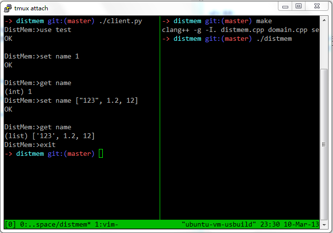

说明
==================
一个简单的KV数据库，仅支持set,get,del，数据类型支持int, float, string和list，可以通过网络访问

安装
==================
运行 `make` 以构建程序，目前仅在32位系统下测试工作。代码目录下有一个client.py 文件，可运行 `./client.py`命令启动客户端，一个典型的使用过程如下(先运行 `./distmem`， 后运行 `./client.py`)：

原理
=======================
数据文件存储在data文件夹下面，使用 ·use·命令使用一个已有的数据库或创建新的数据库，每个数据库对应data目录下的一个子目录，每个子目录包含3个文件：

* .idx 文件，这是索引文件，索引所有入口关键字(固定长度为256字节)，目前实现方式是B树。
* .bif 文件，这是位视图文件，指示dmd文件数据块的位置，模拟链表，参考了FAT12文件格式的实现
* .dmd 文件，这是真实存储文件，文件分为多个块，每个块为256字节，某条记录的块不一定是连续的，通过.bif文件可以找到一条记录的所有块

接下来
========================
* 目前的实现版本中的B树不能删除节点，仅能添加，后续版本会支持，可能会考虑改成B+树。
* 使用了简单的缓存系统，基于LRU算法，但仅仅缓存了索引位置，后续版本会添加具体内容的缓存

联系
==================
Blog: [http://lecoding.com](http://lecoding.com)

Weibo: [http://weibo.com/usbuild](http://weibo.com/usbuild)

Mail: [njuzhangqichao@gmail.com](mailto:njuzhangqichao@gmail.com)